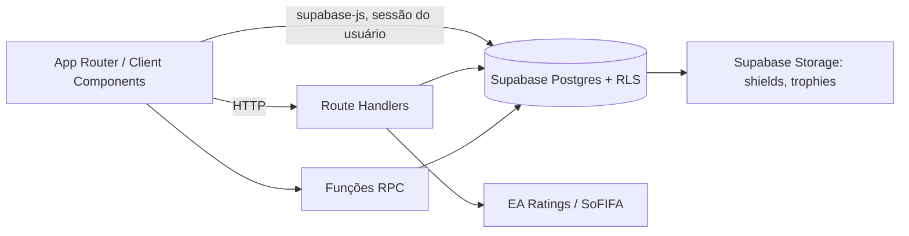

# Arquitetura

## Estado observado

O projeto usa Next.js 16 com App Router e JavaScript, React 19, Tailwind CSS, Supabase e React Query. A maior parte das páginas de dashboard e admin é Client Component e acessa o Supabase diretamente pelo cliente anônimo protegido por RLS. Há Route Handlers para importação e autenticação e duas Server Actions pequenas.

## Pastas

| Caminho | Responsabilidade |
|---|---|
| `src/app` | rotas, layouts e Route Handlers |
| `src/features` | telas agrupadas por domínio (auth, dashboard, admin/invites) |
| `src/components/ui` | `Button`, `Card`, `Badge`, `Modal` reutilizáveis |
| `src/actions` | Server Actions de W.O. e shortlist |
| `src/lib/supabase` | clientes client e server |
| `src/hooks`, `src/providers` | hook de dados e React Query |
| `supabase/*.sql` | schema inicial e atualizações SQL manuais |

## Limites de camada desejados

Componentes apresentam estado e chamam uma interface de dados. Services devem concentrar regra de domínio; transações financeiras e de classificação pertencem a RPCs. Este limite é parcialmente atendido: hoje muitas telas combinam UI, consulta e mutação direta.

## Dados e segurança

RLS é a barreira efetiva para o cliente público. Existem RPCs `SECURITY DEFINER`; sua segurança depende de validação de identidade no corpo da função. O cliente server em `src/lib/supabase/server.js` usa `SUPABASE_SERVICE_ROLE_KEY`; jamais pode ser importado por componentes cliente. Consulte [backend](BACKEND.md) e [banco](DATABASE.md).

## Registro de risco arquitetural

Os arquivos SQL não seguem migrations versionadas do Supabase e `99_apply_all_updates.sql` agrega trechos repetidos. Portanto o repositório não permite provar o schema de um ambiente remoto sem inspeção desse ambiente.
