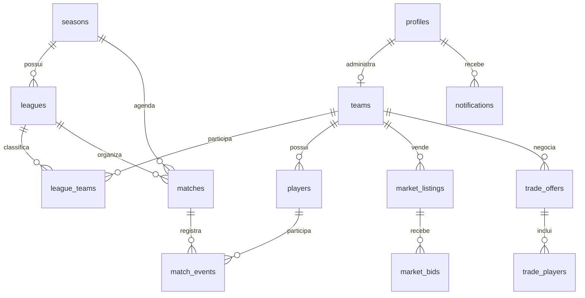

# Banco de dados

## Fonte e limite da auditoria

Esta referência é derivada de `supabase/schema.sql` e scripts de atualização. Como não há migrations versionadas nem conexão de inspeção ao ambiente Supabase, ela descreve o **schema pretendido no repositório**, não certifica o banco remoto. `99_apply_all_updates.sql` contém duplicações e deve ser consolidado antes de ser tomado como fonte executável única.

## Modelo ER

## Tabelas núcleo

| Tabela | Objetivo, campos-chave e relações |
|---|---|
| `profiles` | Espelho de `auth.users`: `id`, `email`, `display_name`, `avatar_url`, `role`, `whatsapp`, `created_at`. Trigger cria perfil. |
| `teams` | Clube: `user_id` único, `name` único, `real_club_name`, `badge_url`, `budget`, `max_wage_cap`, `formation`, `lineup`, `uniform_url`. |
| `players` | Base/importação e elenco: `id` EA/SoFIFA, nome, overall/potential 0–99, posição, `wage`, `value`, `team_id`, atributos e campos de empréstimo. Índices em `team_id`, `rating`, `original_team_id`, `loan_expires_at`. |
| `seasons` | `name`, `status`, flags de mercado. É pai de ligas, partidas e suspensões. |
| `leagues` | Divisão por temporada: `season_id`, `name`, `division`, `status`. |
| `league_teams` | Participação e tabela: liga/time únicos, pontos, jogos, vitórias, empates, derrotas e gols. |
| `rounds` | Rodada de temporada; `matches.round_id` pode referenciá-la. |
| `matches` | Jogo: temporada/liga, times mandante/visitante, placar, `competition_type`, `status`, disputa, rodada, `released`, copa e MOTM. |
| `match_events` | Evento de jogo: partida, time, jogador, tipo (`goal`, `assist`, cartões), minuto. |
| `suspensions` | Suspensão de jogador por temporada e jogo a cumprir, por vermelho ou três amarelos. |

## Mercado e finanças

| Tabela | Objetivo, campos-chave e relações |
|---|---|
| `market_listings` | Anúncio de atleta: jogador, vendedor, tipo, preço/buyout, status e fim. |
| `market_bids` | Lance: anúncio, time, valor, status. |
| `trade_offers` / `trade_players` | Proposta entre times, valores e atletas com direção. |
| `loan_offers` / `loans` | Propostas e registros de empréstimo; jogadores também guardam origem, percentual de salário e expiração. |
| `transfer_history` | Livro de transferências, origem/destino, valor, tipo e data; trigger gera notícias. |
| `sponsorships` | Patrocínio ligado a time, valor, descrição e vigência. |
| `settings` | Configuração chave/valor; telas usam janela salarial, leilão, escudo e razões de valor. |

## Operação e experiência

| Tabela | Objetivo |
|---|---|
| `allowed_emails` | whitelist de convite e marcação de uso |
| `market_news` | mural de notícias, opcionalmente ligado a time |
| `notifications` | título/conteúdo por usuário e marcação de leitura |
| `negotiation_messages` | mensagens entre envolvidos em negociação/empréstimo |
| `shortlists` | jogador salvo por usuário; índices em usuário e jogador |
| `audit_logs` | ação administrativa, entidade e detalhes JSON |
| `player_stats_history` | histórico estatístico por jogador/temporada |
| `trophies` / `team_trophies` | catálogo e concessão de títulos |
| `achievements` | conquistas ligadas a jogador/time, conforme script |
| `waitlist` | interessados e status |

## RLS, Storage e RPC

Todas as tabelas base declaradas habilitam RLS. Há leituras públicas em diversos domínios e policies administrativas, além de policies de posse para shortlist/notificações. Scripts posteriores incluem policies excessivamente amplas (`USING (true)`) para `settings`, troféus e em versões anteriores `players`; confirme o estado remoto antes de confiar nisso.

Buckets `shields` e `trophies` têm políticas em `storage.objects`. RPCs relevantes: `buy_free_agent`, `release_player`, `buy_market_listing`, `place_auction_bid`, `close_auction`, `accept_trade_offer`, `dispute_match`, `confirm_match`, `buy_player_via_buyout`, `accept_loan_offer`, `return_loan_player`, `check_and_return_loans`, resets, `get_team_wages` e `deduct_custom_salaries`. As que alteram saldo, posse ou tabela devem executar autorização explícita e transações seguras.
