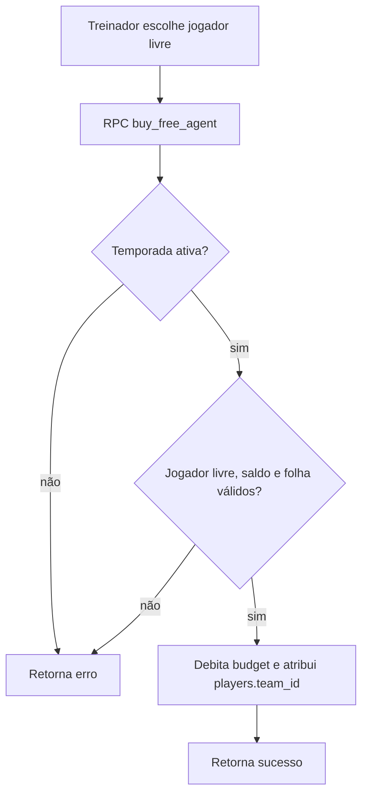
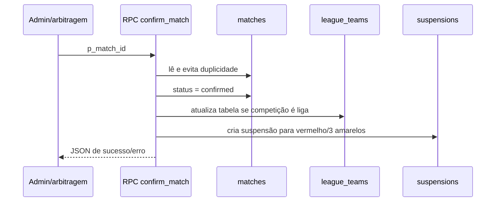

# Fluxos principais

## Contratação de agente livre

## Confirmação de partida

## Cadastro por convite

1. Registro consulta `api/auth/validate-email`.
2. A rota com service role procura e-mail normalizado em `allowed_emails` e rejeita ausente/usado.
3. Após uso, `api/auth/mark-email-used` marca o convite. O trigger de Auth cria o perfil.

## Importação

Admin inicia a tela de importação, que chama rotas EA/SoFIFA. Elas mapeiam campos para `players` e fazem `upsert`. É um fluxo administrativo pretendido, mas a autorização server-side não está comprovada — ver [BACKEND.md](../BACKEND.md).
